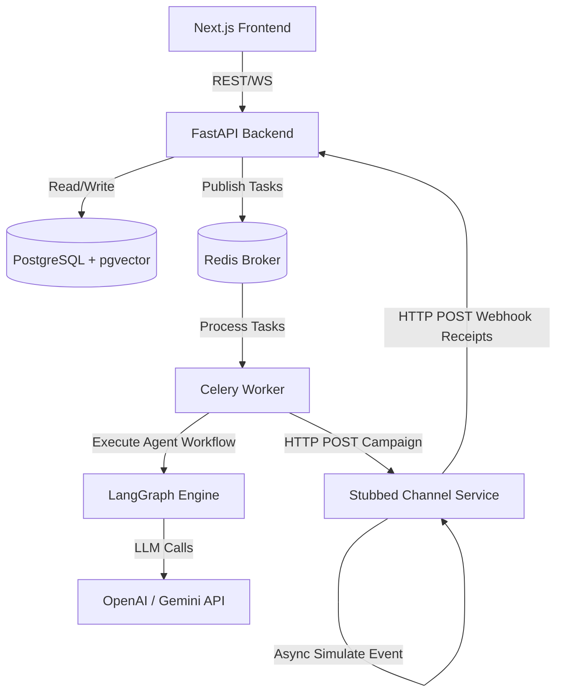

# Xeno: AI-Native Marketing CRM

Xeno is an AI-native marketing CRM built for Direct-to-Consumer (D2C) and retail brands to intelligently identify, personalize, and orchestrate campaign communications across multiple messaging channels (WhatsApp, SMS, Email, and RCS). 

This repository contains the complete production-grade implementation of the Xeno CRM ecosystem, structured iteratively using clean architecture principles.

---

## 🏗️ Production Architecture



### Core Services
1. **Next.js Frontend:** A premium, dark-mode visual CRM designed with Framer Motion, Tailwind CSS, Shadcn UI, and Recharts. Includes an AI workspace, campaigns funnel charts, and customer lists.
2. **FastAPI Backend Core:** Exposes customer management, ingestion pipeline, audience segmentation, campaign orchestration, audit trails, and callback receipt webhooks.
3. **LangGraph Worker:** Leverages a 4-agent state machine (Audience, Content, Channel, and Optimization agents) to autonomously construct campaigns from natural language instructions.
4. **Stub Channel Service:** Simulates cellular and email carrier delivery networks. Asynchronously fires lifecycle receipts back to the CRM API.

---

## 🗄️ Database Schema (PostgreSQL)

```sql
-- Customers Table
CREATE TABLE customers (
    id UUID PRIMARY KEY DEFAULT gen_random_uuid(),
    email VARCHAR UNIQUE INDEX,
    phone VARCHAR UNIQUE INDEX,
    first_name VARCHAR,
    last_name VARCHAR,
    metadata JSONB DEFAULT '{}',
    created_at TIMESTAMP WITH TIME ZONE DEFAULT CURRENT_TIMESTAMP,
    updated_at TIMESTAMP WITH TIME ZONE DEFAULT CURRENT_TIMESTAMP
);

-- Orders Table (Shopper History)
CREATE TABLE orders (
    id UUID PRIMARY KEY DEFAULT gen_random_uuid(),
    customer_id UUID REFERENCES customers(id) ON DELETE CASCADE,
    amount NUMERIC(10, 2) NOT NULL,
    items JSONB DEFAULT '[]',
    status VARCHAR DEFAULT 'completed',
    order_date TIMESTAMP WITH TIME ZONE DEFAULT CURRENT_TIMESTAMP,
    created_at TIMESTAMP WITH TIME ZONE DEFAULT CURRENT_TIMESTAMP
);

-- Segments Table (Cohort Filters)
CREATE TABLE segments (
    id UUID PRIMARY KEY DEFAULT gen_random_uuid(),
    name VARCHAR NOT NULL,
    description TEXT,
    rules JSONB DEFAULT '{}',
    sql_query TEXT,
    ai_explanation TEXT,
    created_at TIMESTAMP WITH TIME ZONE DEFAULT CURRENT_TIMESTAMP
);

-- Campaigns Table
CREATE TABLE campaigns (
    id UUID PRIMARY KEY DEFAULT gen_random_uuid(),
    name VARCHAR NOT NULL,
    segment_id UUID REFERENCES segments(id) ON DELETE SET NULL,
    prompt TEXT,
    status VARCHAR DEFAULT 'draft',
    created_at TIMESTAMP WITH TIME ZONE DEFAULT CURRENT_TIMESTAMP,
    updated_at TIMESTAMP WITH TIME ZONE DEFAULT CURRENT_TIMESTAMP
);

-- Messages Table (Delivery Funnel)
CREATE TABLE messages (
    id UUID PRIMARY KEY DEFAULT gen_random_uuid(),
    campaign_id UUID REFERENCES campaigns(id) ON DELETE CASCADE,
    customer_id UUID REFERENCES customers(id) ON DELETE CASCADE,
    channel VARCHAR NOT NULL, -- whatsapp, sms, email, rcs
    recipient VARCHAR NOT NULL,
    content TEXT NOT NULL,
    status VARCHAR DEFAULT 'pending', -- pending, sent, delivered, failed, opened, read, clicked, converted
    error_message TEXT,
    external_id UUID,
    created_at TIMESTAMP WITH TIME ZONE DEFAULT CURRENT_TIMESTAMP,
    updated_at TIMESTAMP WITH TIME ZONE DEFAULT CURRENT_TIMESTAMP
);

-- Audit Logs Table
CREATE TABLE audit_logs (
    id UUID PRIMARY KEY DEFAULT gen_random_uuid(),
    action VARCHAR NOT NULL,
    actor VARCHAR DEFAULT 'system',
    details JSONB DEFAULT '{}',
    timestamp TIMESTAMP WITH TIME ZONE DEFAULT CURRENT_TIMESTAMP
);
```

---

## 🤖 LangGraph Multi-Agent Architecture

Xeno orchestrates campaign synthesis using a 4-agent graph built on LangGraph:

1. **Audience Agent:** Evaluates natural language marketer prompts, looks up demographic/spending variables, and maps target criteria to segment rules (e.g. `{"days_inactive": 30, "min_spend": 100}`).
2. **Channel Agent:** Chooses the optimal delivery channel based on segment profiles. For example, WhatsApp/RCS is chosen for churned customers (high open rates), while email is chosen for fashion visual catalogues.
3. **Content Agent:** Automatically drafts and personalizes copy templates using shopper metadata properties (e.g. including preferred category details).
4. **Optimization Agent:** Monitors callback statistics (open, click, read rates) to optimize future routing weights and copy generation profiles.

### 🛡️ Robust Fallback & Zero-Config Mode
If `OPENAI_API_KEY` or `GEMINI_API_KEY` is not present, the system defaults to a high-fidelity **Rules-based NLP Parser** utilizing regex and heuristics. This ensures the app is fully executable out-of-the-box without requiring API configuration.

---

## ⚡ Scalability & Failure Handling

### High Volume & Backpressuring
1. **Asynchronous Dispatch Queue:** Campaigns are dispatched using Celery and Redis. Dispatch is broken into chunked tasks (e.g., 500 customers per batch) to avoid memory bloating and DB lock contentions.
2. **Rate-Limiting & Backpressure:** The CRM honors downstream API limits (e.g. WhatsApp business API throughputs) by throttling workers using Redis token buckets.

### Webhook Event Ordering & Retries
1. **Out-of-Order Webhooks:** Webhook callbacks (e.g. `opened` event arriving before `delivered`) are handled by ordering status transitions dynamically via state priority mapping:
   $$\text{pending} < \text{sent} < \text{delivered} < \text{opened} < \text{read} < \text{clicked} < \text{converted}$$
2. **Exponential Backoff:** Callback webhook failures on the Channel Service are queued and retried with exponential backoff ($2^x \times \text{delay}$) up to 5 times. Dead messages are stored in a Dead Letter Queue (DLQ) for manual triage.

---

## 🚀 DevOps & Local Setup

### Running Locally with Docker Compose
To boot up the complete ecosystem (Next.js, FastAPI Backend, Postgres, Redis, and Stub Channel Service) in a single command:

1. Ensure Docker is running.
2. Run the following command in the project root:
   ```bash
   docker-compose up --build
   ```
3. Open the services:
   - **Frontend UI:** `http://localhost:3000`
   - **Backend API Docs:** `http://localhost:8000/api/docs`
   - **Stub Channel Health:** `http://localhost:8001/health`

### Seed Data
Once the Frontend UI opens, click the **"Seed Shopper Data"** button in the lower-left sidebar. This instantly populates your Postgres database with mock customers, order histories, and preferred categories, making the CRM fully interactive.
